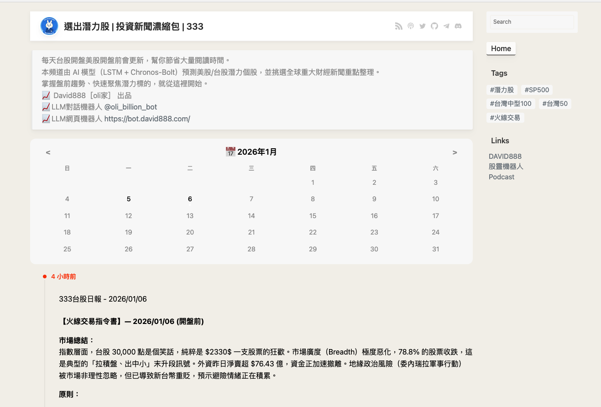

# BroadcastChannel


**將您的 Telegram 頻道轉變為微型部落格 (MicroBlog)**

這是一個基於 Astro 框架的開源專案，可以自動抓取 Telegram 公開頻道的內容，並生成一個 SEO 友善、無需 JavaScript 即可瀏覽的靜態網站。


## ✨ 功能特色 (Features)

- **自動同步**：自動抓取 Telegram 頻道內容 (無需 Bot)
- **SEO 友善**：自動生成 `/sitemap.xml` 和 Meta 標籤
- **極致效能**：瀏覽器端 0 JS (純靜態 HTML/CSS)，載入速度極快
- **RSS 支援**：提供 `/rss.xml` 和 `/rss.json` 訂閱源
- **現代化 UI**：響應式設計，支援深色模式
- **日曆導航**：(本版本新增) 支援依照月份瀏覽歷史文章
- **任意頻道**：(本版本新增) 可透過設定開啟「萬用瀏覽器」模式，瀏覽任意 Telegram 公開頻道
-  安裝了 marked 解析器。
-  修改了渲染邏輯，現在會自動將文章內容進行 Markdown 解析。

## � 近期優化 (2026-01-05)

針對 Telegram 限制與使用體驗進行了以下增強：

- **快取優化**：API 快取時間調整為 **10 分鐘**，確保內容即時性同時減少請求。
- **請求模擬**：加入模擬瀏覽器 Header 與重試機制 (Retry)，解決 `FetchError` 問題。
- **介面升級**：擴展為寬版佈局 (1200px)，新增頂部導航與日曆月份切換功能。

## 🧱 技術堆疊 (Tech Stack)

- **框架**: [Astro](https://astro.build/)
- **資料源**: [Telegram Channels](https://telegram.org/tour/channels)
- **樣板**: [Sepia](https://github.com/Planetable/SiteTemplateSepia)

## 🏗️ 部署方式 (Deployment)

### Docker 部署 (推薦)

```bash
# 1. 建立映像檔 (Build)
docker build -t broadcastchannel .

# 2. 啟動容器 (Run)
# 建議使用 .env 檔案管理設定，並掛載 volume 以保存資料
docker run -d \
  --name broadcastchannel \
  -p 3333:4321 \
  --env-file .env \
  -v broadcastchannel-data:/app/data \
  broadcastchannel

# 3. rebuild
docker stop broadcastchannel && docker rm broadcastchannel && docker build -t broadcastchannel . && docker run -d --name broadcastchannel --env-file .env -p 3333:4321 -v broadcastchannel-data:/app/data broadcastchannel


```

### Serverless 部署

1. [Fork](https://github.com/tbdavid2019/BroadcastChannel/fork) 本專案到您的 GitHub
2. 在 Cloudflare Pages / Netlify / Vercel 建立新專案
3. 選擇 `BroadcastChannel` 儲存庫與 `Astro` 框架
4. 設定環境變數 `CHANNEL` 為您的頻道 ID
5. 儲存並部署

## ❤️ 特別致謝 (Credits)

本專案修改自 **[Miantiao-me](https://github.com/miantiao-me)** 開發的 **[BroadcastChannel](https://github.com/miantiao-me/BroadcastChannel)**。

感謝原作者的開源貢獻，讓 Telegram 內容能以如此優雅的方式呈現於 Web 端。

- 原作者網站：[面条实验室](https://memo.miantiao.me/)
- 原專案儲存庫：[GitHub - BroadcastChannel](https://github.com/miantiao-me/BroadcastChannel)

---


| 變數名稱 (Variable) | 說明 (Description) | 範例 (Example) |
| :--- | :--- | :--- |
| `CHANNEL` | **必填**。資料來源 (Data Source)，即 Telegram 頻道 ID (t.me/ 後面的字串)。 | `olifamily` |
| `ANYCHANNEL` | 設為 `true` 以啟用首頁輸入框與多頻道瀏覽模式 | `true` |
| `LOCALE` | 語言設定 (影響日期顯示) | `zh-tw` |
| `TIMEZONE` | 時區設定 | `Asia/Taipei` |
| `TELEGRAM` | 社群連結 (Social Icon)，Telegram 用戶名 (顯示於 Header 圖示)。若留空則不顯示。 | `olifamily` |
| `TWITTER` | Twitter 用戶名 (顯示於 Header 圖示) | `oobwei` |
| `GITHUB` | GitHub 用戶名 (顯示於 Header 圖示) | `tbdavid2019` |
| `TAGS` | 啟用標籤頁面，使用逗號分隔 | `美股,台股,AI` |
| `LINKS` | 啟用友鏈頁面 (標題,網址;標題,網址) | `Google,https://abcd.com;Blog,https://blog.com` |
| `NAVS` | 自訂導航連結 (標題,網址;標題,網址) | `關於我,https://me.com;作品集,https://port.com` |
| `COMMENTS` | 啟用留言顯示 (需配合 HEADER_INJECT 注入腳本) | `true` |
| `RSS_BEAUTIFY` | 啟用 RSS 美化 (XSLT) | `true` |
| `STATIC_PROXY` | Telegram 圖片代理前綴。預設留空使用內建 `/static/`。 | `https://wsrv.nl/?url=` |
| `GOOGLE_SEARCH_SITE` | 啟用 Google 站內搜尋，填入您的網域 | `stock.david888.com` |
| `HEADER_INJECT` | 注入 HTML 到 `<head>` (如 GA 分析代碼、CSS, AdSense 腳本) | `<script ...></script>` |
| `FOOTER_INJECT` | 注入 HTML 到 `</body>` 前 (如 JS 腳本) | `<script>...</script>` |
| `SIDEBAR_INJECT` | 注入 HTML 到側邊欄「連結 (Links)」下方 (如 AdSense 廣告單元) | `<ins ...></ins><script>...</script>` |
| `NOINDEX` | SEO 設定。若設為 `true`，將告訴搜尋引擎不要索引此網站。 | `true` |
| `NOFOLLOW` | SEO 設定。若設為 `true`，將告訴搜尋引擎不要追蹤此網站上的連結。 | `true` |

### 📢 Google AdSense 設定範例

您可以在 `.env` 中設定以下變數來啟用廣告：

**1. 全域腳本 (`HEADER_INJECT`)**
將 AdSense 提供的 `<script async ...>` 程式碼放入此處。

```env
HEADER_INJECT='<script async src="https://pagead2.googlesyndication.com/pagead/js/adsbygoogle.js?client=ca-pub-XXXXXXXXXXXXXXXX" crossorigin="anonymous"></script>'
```

**2. 側邊欄廣告 (`SIDEBAR_INJECT`)**
將廣告單元代碼放入此處，會在側邊欄「連結」下方顯示。

```env
SIDEBAR_INJECT='<ins class="adsbygoogle" style="display:block" data-ad-client="ca-pub-XXXXXXXXXXXXXXXX" data-ad-slot="1234567890" data-ad-format="auto" data-full-width-responsive="true"></ins><script>(adsbygoogle = window.adsbygoogle || []).push({});</script>'
```

> ⚠️ **注意**：`.env` 變數值建議使用單引號 `'` 包裹，若內容包含單引號請自行轉義。


### 🌍 任意頻道模式 (Any Channel Mode)

啟用此功能後，BroadcastChannel 將變身為 Telegram 萬用瀏覽器，允許使用者在首頁輸入任意公開頻道 ID 進行瀏覽。

**啟用方式：**
在您的 `.env` 中設定 `ANYCHANNEL="true"`。

**功能行為：**
1.  **首頁 (`/`)**：會顯示搜尋框，輸入頻道 ID (例如 `telegram`) 即可跳轉。
2.  **動態路由**：支援 `http://your-site.com/頻道ID` 的網址結構。
3.  **切換頻道**：在瀏覽特定頻道時，側邊欄會出現「🔍 Switch Channel」連結，點擊即可回到首頁輸入新頻道。

**相容性說明 (Backward Compatibility)：**
*   **若未設定 `ANYCHANNEL` 或設為 `false`**：網站將維持「單一頻道模式」，讀取 `CHANNEL` 變數作為預設頻道。首頁不會顯示搜尋框，原有連結結構完全不變。舊有的部署環境不受影響。

---