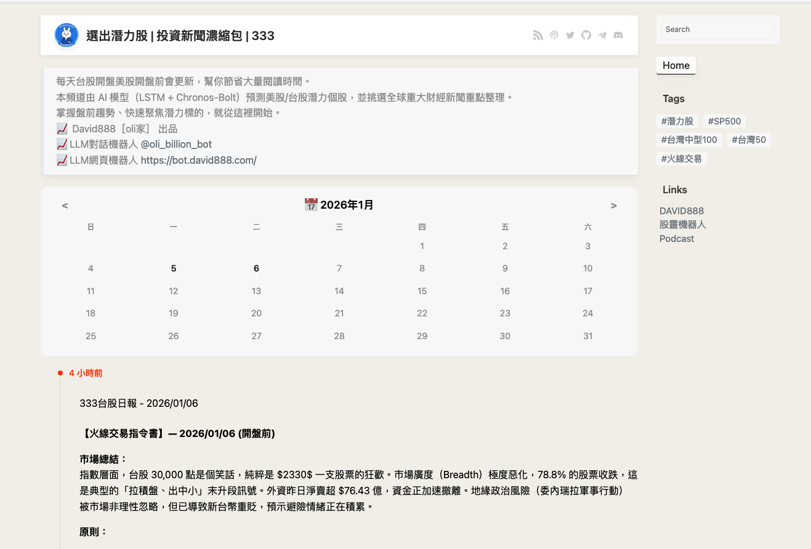

# BroadcastChannel



將 Telegram 公開頻道轉換為可搜尋、可訂閱的網站。BroadcastChannel 以 Astro server rendering 建置，提供文章頁、RSS、日期瀏覽與可選的任意頻道模式。

## 功能

- 讀取 Telegram 公開頻道內容，不需要 Bot。
- 產生文章、標籤、日期、連結與搜尋路由。
- 提供 RSS XML、RSS JSON 與 sitemap。
- 支援單一頻道與任意公開頻道瀏覽模式。
- 內建響應式時間軸、按日期分組的文章清單與日曆導覽。
- 首頁提供近七天熱門公開頻道 Top 10，並支援繁體中文／English 介面切換。
- 提供完整 Open Graph、Twitter Card、JSON-LD、PWA manifest、8 品牌 favicon 與 `/llms.txt`。
- 支援 `HEADER_INJECT`、`FOOTER_INJECT`、`SIDEBAR_INJECT` 等自訂嵌入內容。
- 中文閱讀預設使用 justfont `jf open 粉圓`，並以較大的字級與行高優先；英文、數字、username、URL 與程式碼使用 JetBrains Mono。

## 快速開始

需求：Node.js LTS 與 pnpm 10。

```bash
corepack enable
pnpm install --no-frozen-lockfile
cp .env.example .env
pnpm dev
```

開啟 `http://localhost:4321`。修改 `.env` 的 `CHANNEL` 後，重新啟動開發伺服器即可切換資料來源。

## Docker 部署

Docker image 使用 Node adapter，資料庫檔案保存在 `/app/data`。請保留 volume，避免容器重建後遺失快取資料。
容器啟動時會初始化 `/app/data` 的 owner，然後降權以 `node` 使用者執行服務。

```bash
docker build -t broadcastchannel .

docker run -d \
  --name broadcastchannel \
  --env-file .env \
  -p 3333:4321 \
  -v broadcastchannel-data:/app/data \
  broadcastchannel
```

更新部署時，重建 image 後以相同的 env file 與 volume 重新建立容器。`.env`、`.env2`、`.env3` 及 `key/` 均被 Docker build context 排除，避免設定值進入 image。

## 環境變數

複製 `.env.example` 後，依需求調整下列設定。

| 變數                                                   | 用途                                                        | 範例                       |
| ------------------------------------------------------ | ----------------------------------------------------------- | -------------------------- |
| `CHANNEL`                                              | 單一頻道模式的 Telegram channel handle。                    | `oliservice`               |
| `ANYCHANNEL`                                           | 設為 `true` 時，首頁可輸入任意公開頻道。                    | `true`                     |
| `LOCALE`                                               | 日期與相對時間語系。                                        | `zh-tw`                    |
| `TIMEZONE`                                             | 顯示與日期分組使用的時區。                                  | `Asia/Taipei`              |
| `TELEGRAM`、`TWITTER`、`GITHUB`、`DISCORD`、`PODCASRT` | Header 社群連結。                                           | `oliservice`               |
| `TAGS`                                                 | 啟用標籤清單，以逗號分隔。                                  | `台股,美股,AI`             |
| `LINKS`                                                | 側邊欄連結，格式為 `名稱,URL;名稱,URL`。                    | `網站,https://example.com` |
| `STATIC_PROXY`                                         | Telegram 媒體代理前綴；留空時使用內建 `/static/`。          | `https://wsrv.nl/?url=`    |
| `GOOGLE_SEARCH_SITE`                                   | 啟用 Google 站內搜尋的網域。                                | `example.com`              |
| `RSS_BEAUTIFY`                                         | 設定非空值時，RSS XML 使用內建 XSLT 顯示。                  | `true`                     |
| `COMMENTS`                                             | 設定非空值時，在單篇文章頁顯示 Telegram discussion widget。 | `true`                     |
| `GA_MEASUREMENT_ID`                                    | Google Analytics 4 measurement ID。                         | `G-XXXXXXXXXX`             |
| `HEADER_INJECT`、`FOOTER_INJECT`、`SIDEBAR_INJECT`     | 插入受信任的 HTML 或 script。                               | 見下方說明                 |

### 嵌入內容

`HEADER_INJECT`、`FOOTER_INJECT` 與 `SIDEBAR_INJECT` 會直接輸出 HTML。只應填入可信任的內容，例如 Analytics、AdSense 或自行維護的 script；不要接受使用者輸入後直接寫入這些設定。

```env
HEADER_INJECT='<script async src="https://example.com/analytics.js"></script>'
SIDEBAR_INJECT='<ins class="adsbygoogle" data-ad-slot="1234567890"></ins>'
```

## 路由與訂閱

| 路徑                    | 說明                     |
| ----------------------- | ------------------------ |
| `/`                     | 頻道首頁與最新文章。     |
| `/posts/:id`            | 單篇文章。               |
| `/date/:date`           | 指定日期的文章。         |
| `/tags`、`/links`       | 標籤與連結頁。           |
| `/rss.xml`、`/rss.json` | 訂閱來源。               |
| `/sitemap.xml`          | Sitemap。                |
| `/llms.txt`             | 給 AI agent 讀取的網站摘要與重要入口。 |
| `/:channel/...`         | 任意頻道模式的對應路徑。 |

Agent 與 crawler 可參考 [`public/docs/agent-guide.md`](public/docs/agent-guide.md)；版本異動請看 [CHANGELOG.md](CHANGELOG.md)。

## 字體與介面

- `public/fonts/GenJyuuGothic-Medium.woff2`：中文字型。
- `public/fonts/JetBrainsMono-Medium.woff2`：英文、數字與資料表字型。
- `public/fonts/jf-openhuninn-2.1.ttf`：justfont `jf open 粉圓` 中文字型，依 SIL Open Font License 1.1 提供。
- `public/fonts/OFL-1.1.txt`：`jf open 粉圓` 授權文字。

CSS 以 Unicode range 自動分配字型。資料／程式區塊在寬螢幕會使用完整內容欄寬；只有內容實際超出窄螢幕時才顯示水平捲動。

## 專案結構

```text
src/components/  頁面元件與時間軸
src/layouts/     全站 layout 與 metadata
src/lib/         Telegram、資料庫與環境設定
src/pages/       Astro routes、RSS 與 sitemap
src/assets/      全站與文章樣式
public/          靜態資產、字體與 agent 文件
```

## 致謝

本專案基於 [Miantiao-me](https://github.com/miantiao-me) 的 [BroadcastChannel](https://github.com/miantiao-me/BroadcastChannel) 延伸。
